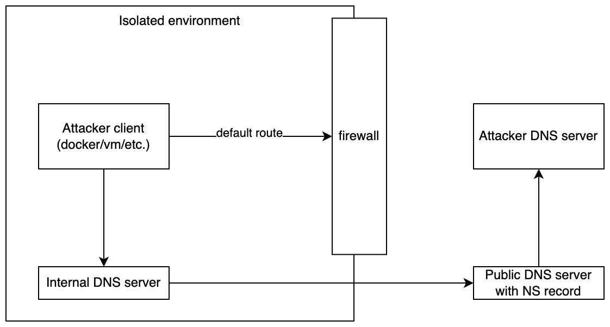

# e8k

Proof of concept of DNS exfiltration using pure DNS queries and A records as configuration responses

```python
a = "domain name system leak"
b = name.replace(" ", "")
c = len(b) - 2
d = f'{int(str(c)[0]) + int(a[0], 16):x}'
f'{d}{str(c)[1]}{a[-1]}'
```



## Usage

### Server

```bash
cd server
pnpm install
pnpm dev
```

### Client

```bash
cd client
./client.sh test-data/kitty.webp
```

## Benchmarks

### Bash client
```bash
# client:
cd client
./client.sh test-data/kitty.webp

# bash client, single chunk per query:
# time taken: 9582ms, file size: 291844 bytes, speed (kb/s): 29.74

# bash client, 3 chunks per query:
# time taken: 14734ms, file size: 291844 bytes, speed (kb/s): 19.34
```

### Golang client
```bash
cd client-go
go run main.go ../client/test-data/kitty.webp 

# time taken: 1791ms, file size: 291844 bytes, speed (kb/s): 159.13
```

### Todo:

- [ ] implement async go client
- [ ] limit sessions to 255 (limit of single ip octet) or use multiple octets as workaround
- [x] golang client
- [x] transfer multiple chunks in single query (3 x 63 chars)
- [x] filename in start session
- [x] speed measurement
